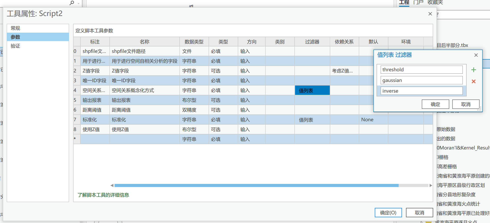
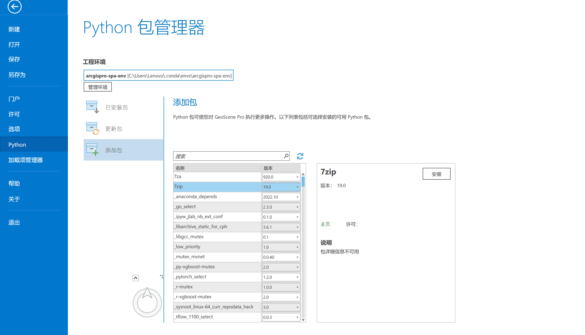

# SpatialWeightMatrix
## 项目描述
一个能够便捷地使用要素类Z值字段计算空间权重矩阵并进行空间自相关分析的工具   
## 特性  
- 支持考虑高程的空间自相关计算
- 可选基于距离的二进制加权、反距离权、高斯权三种空间权重矩阵生成方式
- 支持多shp文件批处理，并创建Global Moran'I分析汇总表
- 权重文件生成过程支持并行计算
- 兼容Arcgis, Arcgis Pro, GeoScene Pro, Geoda
## 使用说明
需要python3解释器，建议python 3.7及以上。    
**请使用release文件夹中的python脚本**
### 使用"cal_moran_pysal"
1. 安装依赖
~~~
pip install geopandas
pip install pandas
pip install numpy
pip install pysal
pip install scipy
pip install splot
pip install matplotlib
~~~
2. 调用模块
~~~python
import sys
sys.path.append(r"{存放cal_moran_pysal.py文件的路径}")
import cal_moran_pysal
~~~
3. 计算Global Moran'I
若要执行对单个要素类的空间自相关分析：
~~~python
global_moran(shp_path,field,output_file,distance_function,threshold,std,elevation)
~~~
若要对某个文件夹中的全部空间要素类进行分析：
~~~python
global_moran_folder(folder_path, field, output_folder, distance_function, threshold, std, elevation)
~~~
### 使用cal_moran_arcpy(_multiprocess)
**必须为Windows操作系统，需要Arcpy模块**      
该脚本可导入Arcgis或GeoScene系列软件的自定义工具箱中使用，获得与Arcgis原生工具箱相似的体验。请优先使用带"multiprocess"后缀的脚本，该脚本支持了多核并行计算，目前已知此脚本在部分GeoScene Pro的图形化界面中可能报错：“pickle.PicklingError: Can't pickle <functionprocess weights at0x0000022901A3A168>: attribute lookup   process weights on  mainfailed”。若出现此问题，请在命令行中使用脚本或在图形化界面中使用不带"multiprocess"后缀的脚本。
> 目前已知可能引发报错的原因是Arcgis Pro或GeoScene Pro在运行时不允许有多个python解释器同时运行，因此限制了多进程部分代码的运行，关闭Arcgis Pro后可在命令行中正常运行。         
      
1. 在Arcgis python包管理器中查看是否包含了下列模块，若缺少，请转到“添加包”
页面安装  
~~~
conda install pandas   
conda install scipy
conda install numpy
~~~

2. 请优先考虑使用realease文件夹中的**带高程空间自相关工具箱.tbx**，在Arcgis，Arcgis Pro的目录窗格/工具箱右键菜单中直接添加工具箱即可。若出现导入异常，则进行如下步骤：
> 1. 打开Arcgis工程的目录窗格/我的工具箱/导入脚本，脚本文件选择cal_moran_arcpy(_multiprocess).py，参数设置如下图所示：

> 2. 双击设置好的脚本，填写参数后运行      

3. 若需要在命令行环境中运行脚本，请填写
~~~python
if __name__ == "__main__":
    shp_path=
    analyze_field=
    ......
~~~
参数并直接运行.py文件
### 使用cal_weight_file
该脚本用于生成适用于Arcgis系列或Geoda进行各种类型空间自相关分析的空间权重矩阵，生成的空间权重矩阵可用于进行Global Moran'I, Lisa, Local Moran'I， Getis-Ord General G等空间统计。    
若需要对单个要素类生成权重矩阵，请使用
~~~python
cal_weight_txt(shp_path,out_path,z_field,id_field,distance_function,
                threshold,elevation,software,thread_num)
~~~
若需要对多个要素类进行批处理，请将它们的shapefile文件放置到同一个文件夹内，并使用：
~~~python
cal_weight_txt_folder(shp_folder,output_folder,z_field,id_field,distance_function,threshold,elevation,software,thread_num)
~~~   
## 附录
### 什么是空间自相关？    
抛开复杂的公式不谈，空间自相关就是某空间单元与周围空间单元在属性上的相关性，即物以类聚，人以群分的思想，研究具有相同或相似属性特征的地理要素在空间分布上是否是有规律的。
详解可查看该博客：    
[新版白话空间统计（2）：空间自相关](https://blog.csdn.net/allenlu2008/article/details/104204891)     
详细的数学推导过程可参考以下论文：   
[Global Moran'I法](https://www.jstor.org/stable/2332142?origin=crossref)    
[LISA法](https://onlinelibrary.wiley.com/doi/epdf/10.1111/j.1538-4632.1995.tb00338.x)
